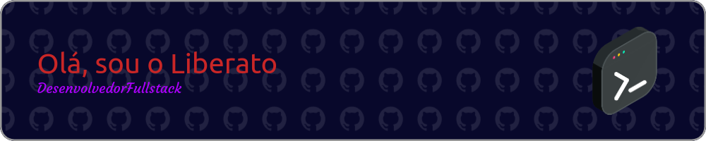

	<h2>
		:pencil: Projetos públicos :pencil:
	</h2>
	

		
	

	

		<ul>
			<li>
				<a href="https://github.com/liberatov13/lazuli-web" target="_blank">
					Lazuli Web
				</a>
			</li>
			<li>
				<a href="https://github.com/liberatov13/fintech-back-end" target="_blank">
					Fintech API
				</a>
			</li>
			<li>
				<a href="https://github.com/liberatov13/fintech-front-end" target="_blank">
					Fintech Front
				</a>
			</li>
			<li>
				<a href="https://github.com/LZL-Tech/lazuli-ui" target="_blank">
					Lazuli UI
				</a>
			</li>
			<li>
				<a href="https://github.com/LZL-Tech/lazuli-api" target="_blank">
					Lazuli API
				</a>
			</li>
		</ul>
	

<h2>
	Status do Github
</h2>

	

 

	

	<h2>
		:envelope: Contatos :envelope:
	</h2>
	
	
	
	
	

<!--
**liberatov13/liberatov13** is a ✨ _special_ ✨ repository because its `README.md` (this file) appears on your GitHub profile.

Here are some ideas to get you started:

- 🔭 I’m currently working on ...
- 🌱 I’m currently learning ...
- 👯 I’m looking to collaborate on ...
- 🤔 I’m looking for help with ...
- 💬 Ask me about ...
- 📫 How to reach me: ...
- 😄 Pronouns: ...
- ⚡ Fun fact: ...
-->
